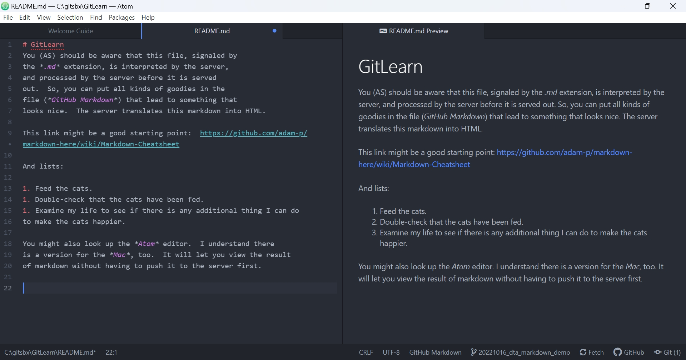

# GitLearn

## Outline

Here is the outline from AS, which I've pasted in here (it was originally
in a separate file, which AS inexplicably deleted):

Still fighting with my editor problem. Creating a change to commit and test.

Adding this line to see if I can push this from the command line using my brand new SSH key
=======
These are a few of the things that come to mind. They are not necessarily
meant to be a chapter each, just a rough timeline / outline for the whole
thing.  Please fee free to expand, amend and delete anything in here as
you see fit.

1. Prologue (Detroit many moons ago)
1. Oktoberfest (this is where it starts)
1. People can't drive stick shifts anymore (talking about everything under the sun)
1. Turks and such (we're not made for the dating world)
1. Covid sucks (summer plans squashed)
1. Friends with Benefits? (what if?)
1. Third time is the charm? (summer 2022)
1. Certifiably Crazy or Proposal in PDF
1. I should have gone to Law School
1. Vegas...
1. The adventure begins (I-130 submit)

## DTA's Further Ramblings About *Git* and *GitHub*

You (AS) should be aware that this file, signaled by
the *.md* extension, is interpreted by the server,
and processed by the server before it is served
out.  So, you can put all kinds of goodies in the
file (*GitHub Markdown*) that lead to something that
looks nice.  The server translates this markdown into HTML.

This link might be a good starting point:  https://github.com/adam-p/markdown-here/wiki/Markdown-Cheatsheet

And lists:

1. Feed the cats.
1. Double-check that the cats have been fed.
1. Examine my life to see if there is any additional thing I can do
to make the cats happier.

You might also look up the *Atom* editor.  I understand there
is a version for the *Mac*, too.  It will let you view the result
of markdown without having to push it to the server first.

The image below shows *Atom* displaying the source text and the
likely view produced by the server, side by side.  Changing
the text of the left updates the instant preview on the right.

